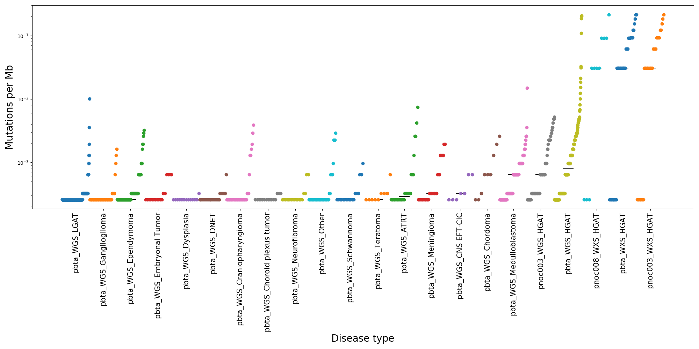

This analysis uses TMB code from [d3b-bix-analysis-toolkit](https://github.com/d3b-center/d3b-bix-analysis-toolkit) and processes 5 MAF files.
  - PNOC003 WXS
  - PNOC003 WGS
  - PNOC008 WXS
  - PBTA WGS
  - PBTA WXS

1. This file goes through  all steps used to generate cumulative distribution function for all MAF files - `TMB_methods_forPBTA.ipynb`

2. Input files -
  - MAF files downloaded from s3 bucket
  - histologies were copied from `d3b-bix-analysis-toolkit`. Details on how they were updated are in this file - `histologies/updating_histology_files.ipynb`

3. All config files for all samples are saved here - `config_files`

4. Output TMB for all samples in all cohorts is saved here - `TMB_outfiles/final_all_cohorts_TMB.txt`

5. Cumulative distribution function plot for all samples is saved here 
